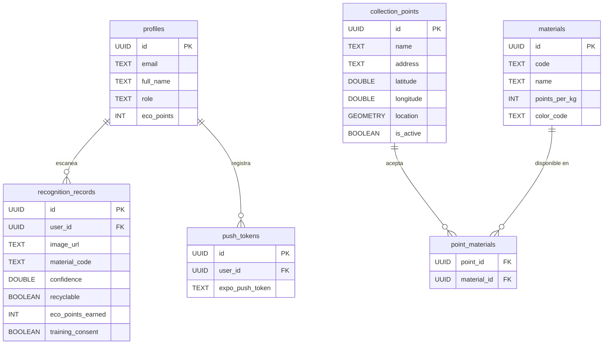

# 🌿 EcoVision AI — Estructura y Finalidad del Proyecto

**Fecha de documentación:** 2026-08-13  
**Organización:** IEEE CIS UNI Ecovision  
**Licencia:** MIT

---

## 🎯 Finalidad del Proyecto

**EcoVision AI** es una plataforma móvil y web **multiplataforma** (iOS, Android, Web) diseñada para revolucionar el reciclaje urbano mediante tres pilares tecnológicos:

1. **Inteligencia Artificial de Visión Computacional** — Usa **Google Gemini 2.5 Flash** para clasificar automáticamente residuos (plástico, vidrio, cartón, aluminio, orgánico, electrónicos) a partir de fotos tomadas por el usuario.

2. **Consultas Geoespaciales PostGIS** — Ubica los puntos de acopio más cercanos al usuario usando funciones `ST_DWithin` y `ST_Distance` ejecutadas directamente en PostgreSQL vía RPC, sin servidores intermediarios.

3. **Gamificación con Eco-Puntos** — Recompensa a los usuarios con puntos acumulables por cada escaneo y reciclaje verificado, fomentando la participación continua.

### Problema que resuelve
Los ciudadanos a menudo no saben cómo clasificar correctamente sus residuos ni dónde llevarlos. EcoVision AI elimina esa barrera al:
- Identificar automáticamente el material con IA
- Dar instrucciones de disposición en español
- Mostrar en un mapa los puntos de reciclaje cercanos
- Motivar al usuario con un sistema de recompensas

### Diferenciador ético
Incluye un **sistema de consentimiento de dataset** donde los usuarios pueden permitir que sus imágenes anonimizadas entrenen futuros modelos de IA ecológica, con total transparencia y control.

---

## 🏛️ Arquitectura del Sistema

```
                        ┌───────────────────────────────────────────────┐
                        │                Cliente Expo                   │
                        │        (React Native + TypeScript)            │
                        └───────┬───────────────────────────────┬───────┘
                                │                               │
                                ▼                               ▼
             ┌─────────────────────────────────────┐  ┌──────────────────┐
             │          Supabase Cloud             │  │   Mapbox Maps    │
             │ ┌─────────────────────────────────┐ │  │  (Mapas/Rutas)   │
             │ │ Auth (Sesiones, Roles, JWT)     │ │  └──────────────────┘
             │ ├─────────────────────────────────┤ │
             │ │ Postgres + PostGIS (Extensión)  │ │
             │ │  RPC: find_nearby_points        │ │
             │ ├─────────────────────────────────┤ │
             │ │ Edge Functions (Deno Runtime)   │ │
             │ │  • classify-waste               │ │
             │ │  • create-cloudinary-signature  │ │
             │ │  • manage-collection-points     │ │
             │ └─────────────────┬───────────────┘ │
             └───────────────────┼─────────────────┘
                                 │
                 ┌───────────────┴───────────────┐
                 ▼                               ▼
    ┌─────────────────────────┐     ┌─────────────────────────┐
    │     Google Gemini       │     │       Cloudinary        │
    │   (Clasificación AI)    │     │  (Almacenamiento Fotos) │
    └─────────────────────────┘     └─────────────────────────┘
```

---

## 🛠️ Stack Tecnológico

| Capa | Tecnología | Versión | Propósito |
|---|---|---|---|
| **Framework** | Expo + React Native | 51.0.0 / 0.74.5 | App multiplataforma (iOS, Android, Web) |
| **Lenguaje** | TypeScript | ~5.3.3 | Tipado estático |
| **Navegación** | Expo Router | ~3.5.23 | File-based routing |
| **Estado Global** | Zustand | ^4.5.5 | State management ligero |
| **Backend** | Supabase | ^2.48.0 | Auth, DB, Edge Functions, RLS |
| **Base de Datos** | PostgreSQL + PostGIS | — | Datos + consultas geoespaciales |
| **IA** | Google Gemini 2.5 Flash | — | Clasificación de residuos por imagen |
| **Mapas (Native)** | @rnmapbox/maps | 10.1.25 | Mapa nativo iOS/Android |
| **Mapas (Web)** | mapbox-gl | ^2.15.0 | Mapa web |
| **Almacenamiento** | Cloudinary | — | Almacenamiento de fotos en la nube |
| **Cámara** | expo-camera | ~15.0.13 | Captura de imágenes |
| **Ubicación** | expo-location | ~17.0.1 | GPS del usuario |
| **Notificaciones** | expo-notifications | ~0.28.19 | Push notifications |
| **Persistencia local** | AsyncStorage | ~1.23.1 | Cache de sesión |

---

## 📁 Estructura del Proyecto

```
IEEE CIS UNI Ecovision/
│
├── 📂 app/                              ← RUTAS (Expo Router, file-based)
│   ├── _layout.tsx                      ← Layout raíz: auth guard, StatusBar, Stack global
│   ├── 📂 (auth)/                       ← Grupo de autenticación
│   │   ├── login.tsx                    ← Pantalla de inicio de sesión
│   │   └── register.tsx                 ← Pantalla de registro
│   ├── 📂 (tabs)/                       ← Grupo de tabs principales
│   │   ├── _layout.tsx                  ← Tab bar flotante (chip pill)
│   │   ├── index.tsx                    ← 🏠 Dashboard: saludo, eco-puntos, acciones rápidas, tips
│   │   ├── camera.tsx                   ← 📸 Escáner: cámara + modales de resultado y consentimiento
│   │   ├── map.tsx                      ← 🗺️ Mapa PostGIS: filtros chip, mapa, drawer de detalle
│   │   ├── history.tsx                  ← 📜 Historial: lista de escaneos pasados con eco-puntos
│   │   └── profile.tsx                  ← ⚙️ Perfil: datos, eco-puntos, consentimiento, push token
│   └── 📂 recognition/
│       └── [id].tsx                     ← Detalle individual de un escaneo (ruta dinámica)
│
├── 📂 components/                       ← COMPONENTES REUTILIZABLES
│   ├── 📂 ui/                           ← Kit base de UI
│   │   ├── Card.tsx                     ← Tarjeta genérica (fondo blanco, borde, sombra)
│   │   ├── Button.tsx                   ← Botón con variantes (primary, secondary, outline, danger)
│   │   └── Input.tsx                    ← Campo de texto con label y error
│   ├── 📂 camera/
│   │   └── CameraView.tsx              ← Visor de cámara, galería, preview y controles
│   ├── 📂 recognition/
│   │   └── WasteResultModal.tsx         ← Modal de resultado de clasificación IA
│   ├── 📂 consent/
│   │   └── TrainingConsentModal.tsx     ← Modal de consentimiento para dataset de IA
│   ├── 📂 collection-points/
│   │   └── PointCard.tsx               ← Tarjeta de punto de acopio (distancia, materiales, ruta)
│   └── 📂 map/
│       ├── Map.native.tsx              ← Componente de mapa para iOS/Android (Mapbox Native)
│       └── Map.web.tsx                 ← Componente de mapa para navegador web (mapbox-gl)
│
├── 📂 services/                         ← INTEGRACIÓN CON APIs EXTERNAS
│   ├── supabase.ts                      ← Cliente Supabase + AsyncStorage para persistencia
│   ├── recognition.ts                   ← Invocación a Edge Function de clasificación (Gemini)
│   ├── cloudinary.ts                    ← Upload directo de imágenes con firma HMAC
│   ├── collectionPoints.ts             ← Llamada RPC a función PostGIS `find_nearby_points`
│   ├── location.ts                      ← Servicio de geolocalización
│   ├── notifications.ts                ← Registro de tokens push en Supabase
│   └── monitoring.ts                    ← Inicialización de Sentry para monitoreo
│
├── 📂 hooks/                            ← HOOKS REACTIVOS (puente entre stores y UI)
│   ├── useAuth.ts                       ← Autenticación, perfil, consentimiento
│   ├── useRecognition.ts               ← Clasificación IA, historial, estado de análisis
│   ├── useCollectionPoints.ts          ← Puntos de acopio cercanos (con filtro por material)
│   ├── useLocation.ts                   ← Obtener coordenadas GPS del usuario
│   └── useNotifications.ts             ← Push notifications (registro token Expo)
│
├── 📂 stores/                           ← ESTADO GLOBAL (Zustand)
│   ├── authStore.ts                     ← Store de autenticación y perfil
│   └── recognitionStore.ts             ← Store de resultados de reconocimiento
│
├── 📂 types/                            ← DEFINICIONES TYPESCRIPT
│   ├── recognition.ts                   ← RecognitionResult, RecognitionRecord
│   ├── collectionPoint.ts              ← CollectionPoint (con materiales aceptados)
│   ├── database.ts                      ← Tipos de base de datos Supabase
│   └── notification.ts                 ← PushToken type
│
├── 📂 utils/                            ← UTILIDADES
│   ├── distance.ts                      ← Formateo de distancias (m → km)
│   ├── image.ts                         ← Helpers de imagen (resize, formato)
│   └── validation.ts                   ← Validaciones de campos
│
├── 📂 supabase/                         ← BACKEND EN LA NUBE
│   ├── 📂 functions/                    ← Edge Functions (Deno Runtime)
│   │   ├── 📂 classify-waste/          ← Recibe imagen → llama Gemini → devuelve clasificación
│   │   │   └── index.ts
│   │   ├── 📂 create-cloudinary-signature/  ← Genera firma HMAC para subir a Cloudinary
│   │   │   └── index.ts
│   │   └── 📂 manage-collection-points/ ← CRUD de puntos de acopio (admin only)
│   │       └── index.ts
│   └── 📂 migrations/                  ← Migraciones SQL
│       ├── 0001_init_schema.sql         ← Tablas: profiles, materials, collection_points, push_tokens
│       ├── 0002_enable_postgis.sql      ← Extensión PostGIS + columna geometry + índice espacial
│       ├── 0003_find_nearby_points.sql  ← Función RPC `find_nearby_points(lat, lng, radius, filter)`
│       └── 0004_recognition_consent_fields.sql ← Tabla recognition_records + anonimización
│
├── 📂 assets/                           ← RECURSOS ESTÁTICOS
│   ├── icon.png                         ← Ícono de la app
│   ├── adaptive-icon.png               ← Ícono adaptivo Android
│   ├── splash.png                       ← Splash screen
│   └── favicon.png                      ← Favicon web
│
├── 📂 ecovision/                        ← Sub-proyecto adicional (referencia/legacy)
│
├── app.config.ts                        ← Configuración dinámica Expo (dev/prod, permisos, plugins)
├── eas.json                             ← Perfiles de compilación EAS Build
├── package.json                         ← Dependencias npm
├── tsconfig.json                        ← Configuración TypeScript
├── .env / .env.example                  ← Variables de entorno
└── 📂 docs/                             ← Documentación del proyecto
```

---

## 🗄️ Modelo de Base de Datos



---

## 🔄 Flujos Principales

### 1. Clasificación de Residuo (Flujo Core)
```
Usuario → Toma foto → [CameraView] → Confirma → [useRecognition.processWasteImage]
  → Sube imagen a Cloudinary (firma HMAC)
  → Invoca Edge Function "classify-waste"
    → Edge Function envía imagen a Google Gemini 2.5 Flash
    → Gemini devuelve: material, confianza, reciclable, instrucciones
  → Guarda resultado en recognition_records (Supabase)
  → Suma eco-puntos al perfil del usuario
  → Muestra WasteResultModal con resultado
```

### 2. Búsqueda de Puntos de Acopio
```
Usuario → Abre pestaña Mapa → [useLocation] obtiene GPS
  → [useCollectionPoints] llama RPC find_nearby_points(lat, lng, 5km)
    → PostGIS ejecuta ST_DWithin + ST_Distance en la DB
  → Renderiza marcadores en Mapbox
  → Usuario toca marcador → PointCard con detalle
```

### 3. Consentimiento de Dataset
```
Antes del primer escaneo → Muestra TrainingConsentModal
  → Usuario acepta/rechaza → Se guarda en perfil
  → Al escanear: training_consent = true/false en cada registro
  → Al eliminar cuenta: registros con consent=true se anonimizan, rest se borran
```

---

## 🔐 Seguridad

- **Row Level Security (RLS)** en todas las tablas de Supabase
- Los usuarios solo ven **sus propios** registros de reconocimiento
- Las Edge Functions usan **secretos del servidor** para las API keys
- La firma de Cloudinary usa **HMAC** para evitar uploads no autorizados
- El consentimiento de dataset respeta la **anonimización** controlada por función SQL `SECURITY DEFINER`

---

## 📱 Pantallas de la App

| Tab | Pantalla | Descripción |
|---|---|---|
| 🏠 Dashboard | `index.tsx` | Saludo, eco-puntos, acciones rápidas, tips de reciclaje |
| 📸 Escanear | `camera.tsx` | Cámara/galería → clasificación IA → resultado |
| 🗺️ Mapa | `map.tsx` | Mapa con puntos de acopio, filtros por material |
| 📜 Historial | `history.tsx` | Lista de escaneos anteriores con puntos ganados |
| ⚙️ Perfil | `profile.tsx` | Datos del usuario, consentimiento, push token, cerrar sesión |
